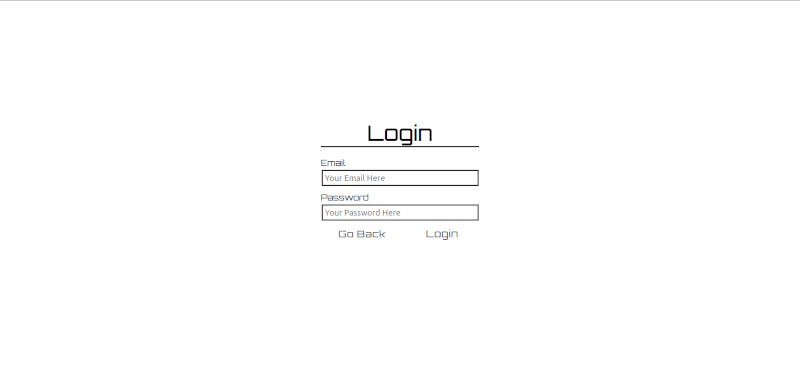
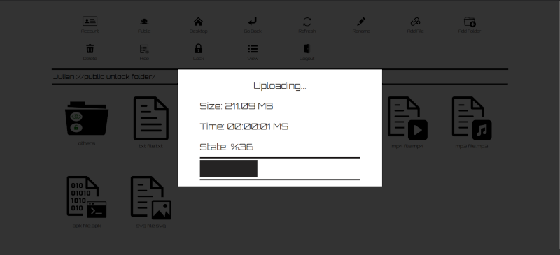
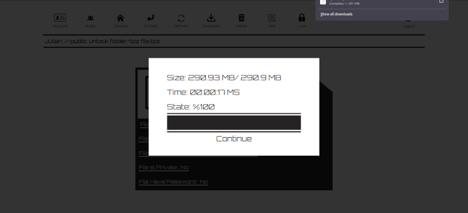

<div style="display:flex;width:600px;height:auto;margin:10px auto;padding:5px;justify-content:center; background-color:rgba(10, 10, 10, 0.05)">
    
</div>

# ShareYourFiles

---

## Table of Contents

---
- [ShareYourFiles](#shareyourfiles)
	- [Table of Contents](#table-of-contents)
	- [General Information](#general-information)
	- [Features](#features)
    - [Customization](#customization)
	- [Documentation](#documentation)
	- [Technologies Used](#technologies-used)
	- [Screenshots](#screenshots)
    - [System Requirements](#system-requirements)
	- [Setup](#setup)
    - [Known Bugs and Issues](#known-bugs-and-issues)
    - [Q & A](#q--a)
    - [License](#license)
	- [Room for Improvement](#room-for-improvement)
	- [To Do](#to-do)
	- [Contact](#contact)
---

## General Information

---
This project was born from the need to make proprietary software available to a client without having to host it in an online storage service that the client does not own, such as Google Drive, Mega, etc.

Since FTP servers are currently considered insecure, the idea was to create a service that could be deployed on a linux server reasonably easily and allow a developer, via a web interface, to create a user account for a client and give them temporary access to folders and files.

**Note** : This service **is not** intended to facilitate or promote piracy in any way, its use is under the responsibility of the user.

---
&ensp; <font size="2">[Table of Contents](#table-of-contents)</font>

## Features

---
- **Token Cookie**
> This application uses a custom token cookie instead of the default session id and is encrypted using the AES algorithm. 
- **Internationalization**
> The web interface, content, and response messages are in both English and Spanish, depending on the 'Accepted Language' header of the request and the browser's default language. By default, language is english.
- **Responsive Design**
> The web interface of this service can be used from a PC, Table or Mobile.
- **Password Protection**
> Password protect folders and files even after uploading(the password does not encrypt the file content, only limits the access).
- **Folder and File Visibility**
> Folders and files have a visibility property (public or private) that can be changed at any time and limits their visibility to other users.
- **Public Space**
> If a folder is created on your desktop with public visibility, that folder will appear in the 'public' section.
- **Multi-Part File Storage**
> Instead of storing the file within a physical storage unit, this service divides the file contents (as a byte array) into 200-megabyte chunks and stores them in order as records in a database. In the future, this may allow for an additional encryption stage using a unique user password, this feature is not yet implemented.
---
&ensp; <font size="2">[Table of Contents](#table-of-contents)</font>

## Customization

Using the 'application-prod.properties' file you can set :
1. The token AES encryption password.
2. The token initial life time.
3. The token renewal life time.
4. The max file size allowed.
5. Disable/Enabled the new account creation.
6. The SSL configuration properties.

&ensp; <font size="2">[Table of Contents](#table-of-contents)</font>

## Documentation

---
This project uses the Javadoc comments and tags, you can generate the code documentation using the following command in the root directory:
```
$ sudo ./gradlew javadoc
```

**Note** : './build/docs/javadoc' is the output directory.

---
&ensp; <font size="2">[Table of Contents](#table-of-contents)</font>

## Technologies Used

---
>**BackEnd**
- Java 17
- [Gradle 7.6.1](https://gradle.org/)
- [Spring Boot 3.0.6](https://spring.io/)
- [Spring Boot Starter JPA 3.0.6](https://mvnrepository.com/artifact/org.springframework.boot/spring-boot-starter-data-jpa) 
- [Spring Boot Starter Security 3.0.6](https://mvnrepository.com/artifact/org.springframework.boot/spring-boot-starter-security)
- [Spring Boot Starter Validation 3.0.6](https://mvnrepository.com/artifact/org.springframework.boot/spring-boot-starter-validation)
- [Spring Boot Starter Web 3.0.6](https://mvnrepository.com/artifact/org.springframework.boot/spring-boot-starter-web)
- [Spring Boot Starter WebFlux 3.0.6](https://mvnrepository.com/artifact/org.springframework.boot/spring-boot-starter-webflux)
- [Hibernate Validator Engine 8.0.0](https://mvnrepository.com/artifact/org.hibernate.validator/hibernate-validator)
- [Spring Boot Starter Thymeleaf 3.0.6](https://mvnrepository.com/artifact/org.springframework.boot/spring-boot-starter-thymeleaf)
- [Thymeleaf Extras Springsecurity6 3.1.1](https://mvnrepository.com/artifact/org.thymeleaf.extras/thymeleaf-extras-springsecurity6)
- [Jackson Databind 2.14.2](https://mvnrepository.com/artifact/com.fasterxml.jackson.core/jackson-databind)
- [PostgreSQL JDBC Driver 42.5.4](https://mvnrepository.com/artifact/org.postgresql/postgresql)
---
>**FrontEnd**
- HTML
- CSS
- JavaScript
- [Orbitron Font](https://fonts.google.com/specimen/Orbitron)
- [SVG Icons](https://uxwing.com/)

---
>**Testing**
- [Spring Boot Starter Test 3.06](https://mvnrepository.com/artifact/org.springframework.boot/spring-boot-starter-test)
- [Spring Security Test 6.0.3](https://mvnrepository.com/artifact/org.springframework.security/spring-security-test)
- [JUnit Jupiter 5.9.3](https://mvnrepository.com/artifact/org.junit.jupiter/junit-jupiter)
- [HTMLUnit 3.3.0](https://mvnrepository.com/artifact/org.htmlunit/htmlunit)
---
>**Tools**

- [IntelliJ IDEA 2023.1.3 (Community Edition)](https://www.jetbrains.com/idea/)
- [Inkscape 1.2.2](https://inkscape.org/es/)
- [DBeaver 23.1.1](https://dbeaver.io/)
- [Kernel Virtual Machine](https://www.linux-kvm.org/page/Main_Page)
---

>**OS**
- [Ubuntu 22.04.2 LTS](https://releases.ubuntu.com/jammy/)
- [Openjdk 17.0.7 2023-04-18](https://openjdk.org/projects/jdk/17/)
- [OpenJDK Runtime Environment build 17.0.7+7]((https://openjdk.org/projects/jdk/17/))
- [OpenJDK 64-Bit Server VM build 17.0.7+7]((https://openjdk.org/projects/jdk/17/))

---
&ensp; <font size="2">[Table of Contents](#table-of-contents)</font>


## Screenshots

---
<div style="display:grid;justify-content:left;width:auto;max-width:1210px;height:auto;margin: 0 auto;padding:10px;grid-template-columns:auto auto auto;justify-content:center;align-items:center;gap:10px;background-color:rgba(10, 10, 10, 0.05);">
	<div style="display:flex;width:auto;height:auto;margin:0;padding:0;position:relative;">
		<a href="./README_IMG/home_en.png" style="background-color:transparent;width:393px;height:180px;position:absolute;left:0;top:0;outline:none;"></a>
		
	</div>
	<div style="display:flex;width:auto;height:auto;margin:0;padding:0;position:relative;">
		<a href="./README_IMG/registration_1_en.png" style="background-color:transparent;width:393px;height:180px;position:absolute;left:0;top:0;outline:none;"></a>
		
	</div>
	<div style="display:flex;width:auto;height:auto;margin:0;padding:0;position:relative;">
		<a href="./README_IMG/login_en.png" style="background-color:transparent;width:393px;height:180px;position:absolute;left:0;top:0;outline:none;"></a>
		
	</div>
	<div style="display:flex;width:auto;height:auto;margin:0;padding:0;position:relative;">
		<a href="./README_IMG/account_en.png" style="background-color:transparent;width:393px;height:180px;position:absolute;left:0;top:0;outline:none;"></a>
		
	</div>
	<div style="display:flex;width:auto;height:auto;margin:0;padding:0;position:relative;">
		<a href="./README_IMG/desktop_1_en.png" style="background-color:transparent;width:393px;height:180px;position:absolute;left:0;top:0;outline:none;"></a>
		
	</div>
	<div style="display:flex;width:auto;height:auto;margin:0;padding:0;position:relative;">
		<a href="./README_IMG/desktop_2_en.png" style="background-color:transparent;width:393px;height:180px;position:absolute;left:0;top:0;outline:none;"></a>
		
	</div>
	<div style="display:flex;width:auto;height:auto;margin:0;padding:0;position:relative;">
		<a href="./README_IMG/folder_en.png" style="background-color:transparent;width:393px;height:180px;position:absolute;left:0;top:0;outline:none;"></a>
		
	</div>
	<div style="display:flex;width:auto;height:auto;margin:0;padding:0;position:relative;">
		<a href="./README_IMG/file_en.png" style="background-color:transparent;width:393px;height:180px;position:absolute;left:0;top:0;outline:none;"></a>
		
	</div>
	<div style="display:flex;width:auto;height:auto;margin:0;padding:0;position:relative;">
		<a href="./README_IMG/upload_file_1_en.png" style="background-color:transparent;width:393px;height:180px;position:absolute;left:0;top:0;outline:none;"></a>
		
	</div>
	<div style="display:flex;width:auto;height:auto;margin:0;padding:0;position:relative;">
		<a href="./README_IMG/upload_file_2_en.png" style="background-color:transparent;width:393px;height:180px;position:absolute;left:0;top:0;outline:none;"></a>
		
	</div>
	<div style="display:flex;width:auto;height:auto;margin:0;padding:0;position:relative;">
		<a href="./README_IMG/upload_file_3_en.png" style="background-color:transparent;width:393px;height:180px;position:absolute;left:0;top:0;outline:none;"></a>
		
	</div>
	<div style="display:flex;width:auto;height:auto;margin:0;padding:0;position:relative;">
		<a href="./README_IMG/download_file_1_en.png" style="background-color:transparent;width:393px;height:180px;position:absolute;left:0;top:0;outline:none;"></a>
		
	</div>
	<div style="display:flex;width:auto;height:auto;margin:0;padding:0;position:relative;">
		<a href="./README_IMG/download_file_2_en.png" style="background-color:transparent;width:393px;height:180px;position:absolute;left:0;top:0;outline:none;"></a>
		
	</div>
	<div style="display:flex;width:auto;height:auto;margin:0;padding:0;position:relative;">
		<a href="./README_IMG/download_file_3_en.png" style="background-color:transparent;width:393px;height:180px;position:absolute;left:0;top:0;outline:none;"></a>
		
	</div>
	<div style="display:flex;width:auto;height:auto;margin:0;padding:0;position:relative;">
		<a href="./README_IMG/download_file_4_en.png" style="background-color:transparent;width:393px;height:180px;position:absolute;left:0;top:0;outline:none;"></a>
		
	</div>
	<div style="display:flex;width:auto;height:auto;margin:0;padding:0;position:relative;">
		<a href="./README_IMG/public_en.png" style="background-color:transparent;width:393px;height:180px;position:absolute;left:0;top:0;outline:none;"></a>
		
	</div>
	<div style="display:flex;width:auto;height:auto;margin:0;padding:0;position:relative;">
		<a href="./README_IMG/public_folder_en.png" style="background-color:transparent;width:393px;height:180px;position:absolute;left:0;top:0;outline:none;"></a>
		
	</div>
	<div style="display:flex;width:auto;height:auto;margin:0;padding:0;position:relative;">
		<a href="./README_IMG/public_file_en.png" style="background-color:transparent;width:393px;height:180px;position:absolute;left:0;top:0;outline:none;"></a>
		
	</div>
</div>

&ensp; <font size="2">[Table of Contents](#table-of-contents)</font>

## System Requirements

---
In a pre-production environment (Ubuntu Server Virtual Machine) this service run without errors :

>**OS** : Ubuntu 18.04 Server 64 Bits
> 
>**CPU** :  2.40GHz  2 CPU Cores 
> 
>**RAM** : 15684 MiB

RAM requirements depend on the maximum file size allowed and the number of users expected.

> **Warning** : Files greater than 1GB may cause memory issues.
>
> Read the [Known Bugs and Issues](#known-bugs-and-issues).

---
&ensp; <font size="2">[Table of Contents](#table-of-contents)</font>

## Setup

---
1. [Install Java SDK 17 - Linux](#install-java-openjdk-17---linux)
2. [Install PostgreSQL - Linux](#install-postgresql---linux)
3. [Setup PostgreSQL Database and User - Linux](#setup-postgresql-database-and-user---linux)
4. [Clone the GitHub Repository - Linux](#clone-the-github-repository---linux)
5. [Execute the SQL Scripts - Linux](#execute-the-sql-scripts---linux)
6. [Generate free SSL Certificate using Let's Encrypt and Certbot (Optional)](#generate-free-ssl-certificate-using-lets-encrypt-and-certbot) 
7. [Compile and Run the Project - Linux](#compile-and-run-the-project---linux)
---

## Install Java OpenJDK 17 - Linux

---
0. Open a Terminal.

1. First, update the apt package index with:
```
$ sudo apt update
```

2. Once the package index is updated install the Java OpenJDK 17 package with:
```
$ sudo apt install openjdk-17-jdk
```

3. Verify the installation, by running the following command which will print the Java version:
```
$ java --version
```
&ensp; <font size="2">[Setup](#setup)</font>
&ensp; <font size="2">[Table of Contents](#table-of-contents)</font>

## Install PostgreSQL - Linux

---
0. Open a Terminal.
1. First, update the apt package index with:
```
$ sudo apt update
```
2. Once the package index is updated install PostgreSQL with:
```
$ sudo apt install postgresql postgresql-contrib
```
3. Ensure that the server is running using the systemctl start command:
```
$ sudo systemctl start postgresql.service
```
&ensp; <font size="2">[Setup](#setup)</font>
&ensp; <font size="2">[Table of Contents](#table-of-contents)</font>

## Setup PostgreSQL Database and User - Linux

---
0. Open a Terminal.
1. Connect to PostgreSQL Server through psql:
```
$ sudo -u postgres psql
```
2. Create a new Database called 'share_you_files_db' :
```
postgres=# create database share_you_files_db;
```
3. Create a new user called 'share_your_files_user' :
```
postgres=# create user share_your_files_db with encrypted password 'share_your_files_password';
``` 
4. Set the new user as the database owner :
```
postgres=# ALTER DATABASE share_your_files_db OWNER TO share_your_files_user;
```
5. Give privileges to 'share_your_files_user' user :
```
postgres=# grant all privileges on database app to 'share_your_files_user';
```

&ensp; <font size="2">[Setup](#setup)</font>
&ensp; <font size="2">[Table of Contents](#table-of-contents)</font>


## Clone the GitHub Repository - Linux

---
0. Open a Terminal.
1. Choose a directory, in this example will be ‘…/Documents/Git/’.
2. Clone the repository :
```
$ git clone https://github.com/JulianDbs/ShareYourFiles.git
```
&ensp; <font size="2">[Setup](#setup)</font>
&ensp; <font size="2">[Table of Contents](#table-of-contents)</font>

## Execute the SQL Scripts - Linux

---
0. Open a Terminal.
1. Try to log-in as ‘share_your_files_user’ (password : 'share_your_files_password') using psql :
```
$ sudo psql -U share_your_files_user share_your_files_db
```
2. If you login successfully, exit from psql using the ‘\q’, if you get an authentication error go [here](#fix-postgresql-authentication-error-linux).
```
share_your_files_db=> \q
```
3. Go to the ‘SQL_SCRIPTS’ folder in the project root directory :
```
$ cd ShareYourFiles/SQL_SCRIPTS/
```
4. Execute the ‘0_create_tables.sql’ :
```
$ sudo psql share_your_files_user -h 127.0.0.1 -d share_your_files_db -f 0_create_tables.sql
```
5. Execute the ‘1_insert_data.sql’ :
```
$ sudo psql share_your_files_user -h 127.0.0.1 -d share_your_files_db -f 1_insert_data.sql
```
&ensp; <font size="2">[Setup](#setup)</font>
&ensp; <font size="2">[Table of Contents](#table-of-contents)</font>

## Fix PostgreSQL Authentication Error - Linux

---
If you get the “psql: error: FATAL: Peer authentication failed for user ‘share_your_files_user’” error you can fix it following this steps :

0. Open a Terminal.
1. Open the ‘pg_hba.conf’ file in the ‘/etc/postgresql/14/main/’ directory :
```
$ sudo nano /etc/postgresql/14/main/pg_hba.conf
```
2. Find the line :
```
# local         DATABASE  USER  ADDRESS  METHOD  [OPTIONS]
```
3. and add :
```
local share_your_files_db share_your_files_user  md5
```
4. Press ctrl + s to save the changes and press ctrl + x to exit.
5. Restart the PostgreSQL service with this command :
```
$ sudo systemctl restart postgresql
```
&ensp; <font size="2">[Setup](#setup)</font>
&ensp; <font size="2">[Table of Contents](#table-of-contents)</font>

## Generate free SSL Certificate using Let's Encrypt and Certbot.

Extracted from the [How To Use Certbot Standalone Mode to Retrieve Let's Encrypt SSL Certificates on Ubuntu 20.04](https://www.digitalocean.com/community/tutorials/how-to-use-certbot-standalone-mode-to-retrieve-let-s-encrypt-ssl-certificates-on-ubuntu-20-04) from https://www.digitalocean.com

---
0. Open a Terminal. 
1. Install snap (if you don't have it) :
```
$ sudo snap install core
```
```
$ sudo snap refresh core
```
2. Install Certbot :
```
$ sudo snap install --classic certbot
```
> **Note** : Certbot uses the 80(HTTP) or 443(HTTPS) ports to get the SSL certificate. 

3. Run Certbot :
```
$ sudo certbot certonly --standalone -d your_domain
```
> 'When running the command, you will be prompted to enter an email address and agree to the terms of service. After doing so, you should see a message telling you the process was successful and where your certificates are stored'
```
Output
IMPORTANT NOTES:
Successfully received certificate.
Certificate is saved at: /etc/letsencrypt/live/your_domain/fullchain.pem
Key is saved at: /etc/letsencrypt/live/your_domain/privkey.pem
This certificate expires on 2022-02-10.
These files will be updated when the certificate renews.
Certbot has set up a scheduled task to automatically renew this certificate in the background.

- - - - - - - - - - - - - - - - - - - - - - - - - - - - - - - - - - - - - - - -
If you like Certbot, please consider supporting our work by:
* Donating to ISRG / Let's Encrypt: https://letsencrypt.org/donate
* Donating to EFF: https://eff.org/donate-le
```

>**Note** :  the SSL certificate will be located in the '/etc/letsencrypt/live/your_domain' directory.

4. Add to the 'application-prod.properties' the following code :
```
#SSL
security.require-ssl=true
server.ssl.key-store=classpath:/etc/letsencrypt/live/<your_domain>/keystore.p12
server.ssl.key-store-password: <your-password>
server.ssl.keyStoreType: PKCS12
server.ssl.keyAlias: tomcat
```

---
&ensp; <font size="2">[Setup](#setup)</font>
&ensp; <font size="2">[Table of Contents](#table-of-contents)</font>

## Compile and Run the Project - Linux

---
0. Open a Terminal.
1. Go to the project root directory.
2. Execute the gradle bootJar command :
```
$ sudo ./gradlew bootJar
```
3. Create a new folder to store the jar, like '/etc/ShareYourFiles/'.
4. Copy the ' ./build/libs/share-your-files-1.0.0.jar' jar file into the '/etc/ShareYourFiles/' directory.
5. Copy the './src/main/resources/application-prod.properties' file into the '/etc/ShareYourFiles/' directory..
6. Customize the 'application-prod.properties' :
```
spring.config.activate.on-profile=prod
server.error.whitelabel.enabled=false
spring.datasource.url=jdbc:postgresql://127.0.0.1/<YOUR DATABASE NAME HERE>
spring.datasource.username=<YOUR POSTGRESQL USER HERE>
spring.datasource.password=<YOUR POSTGRESQL USER PASSWORD HERE>
spring.jpa.properties.hibernate.jdbc.lob.non_contextual_creation=true
spring.jpa.properties.hibernate.dialect=org.hibernate.dialect.PostgreSQLDialect
spring.jpa.hibernate.dll-auto=none
spring.jpa.open-in-view=false

spring.servlet.multipart.max-file-size=4000MB
spring.servlet.multipart.max-request-size=4000MB

canCreateNewAccounts = false

#App
app.token.encryption-key=<YOUR TOKEN ENCRYPTION PASSWORD HERE>
app.token.base-minutes=20
app.token.extra-minutes=20

#Defalt 4000000000 == 4G
app.file.max-file-size=4000000000
```

7. Execute the .jar
```
$ java -jar /etc/ShareYourFiles/shareyourfiles-1.0.0.jar
```
8. Open your favorite web browser and go to ‘https://your-domain-name/’, if you don't use a domain and SSL certificate go to ‘http://localhost:8080/’

## Known Bugs and Issues

---
**Custom Error View**
> The custom error view does not work since the GlobalExceptionHandler controller advice catch the exception first and returns a JSON response.

**Memory Issues**
> Uploading files larger than 1 Gigabytes may cause 'java.lang.OutOfMemoryError' exceptions, this does not necessarily have to do with the amount of memory allocated to the service (jar), it can be caused by the amount of memory allocated to PostgreSQL.
> 
>As far as I know, you have to be careful when modifying the memory values in the 'postgresql.conf' file, some properties require a fraction of the total system memory like the 'shared_buffers ' property (value that should only be between 15 % and 25% of the total RAM memory).
---
&ensp; <font size="2">[Table of Contents](#table-of-contents)</font>

## Q & A

---
- Is it mandatory to have an SSL certificate to run this project ?
> No, it is not, but since the web interface handles sensitive information (such as emails, passwords, etc...) using only the HTTP protocol would leave this information exposed.
- The SSL certificate generated with Certbot(Let's Encrypt) works both for domain requests (https://your-domine-name/login) and ip requests (https://123.123.123.123/login) ? 
> No, as far as I know, the free DV SSL certificate generated with Certbot(Let's Encrypt) only applies to domain names.
- This service works only with the DV SSL certificate generated by Let's Encrypt ?
> Of course not, I use the DV (Domain Validation) certificate as an example of how to apply an SSL certificate in this service, according to my understanding, the indicated certificate in this case would be the Organization Validated (OV) or Individual Validated (IV) because it is commonly used for client authorization ([source](https://www.ssl.com/article/dv-ov-and-ev-certificates/)).
---
&ensp; <font size="2">[Table of Contents](#table-of-contents)</font>

## License

---
This project is licensed under the **Apache 2.0 License**.

Full license text is available in the [LICENSE](./LICENSE) file.

---
&ensp; <font size="2">[Table of Contents](#table-of-contents)</font>

## Room for Improvement

---
- **Public folder search functionality.**
- **Multi file upload functionality**
- **Custom nav bar for mobile support.**
---
&ensp; <font size="2">[Table of Contents](#table-of-contents)</font>

## To Do

---
- **Add Admin Panel**
- **Add filter to forbidden characters (!"#$%&...) on folder and user creation.**
- **Make implementation tests to services and repositories.**
- **Make more implementation test to MVC controllers.**
- **Make unitary test to java DTO files.**
---
&ensp; <font size="2">[Table of Contents](#table-of-contents)</font>

## Contact

---
Created by [@_julian_dbs](https://twitter.com/_julian_dbs)

---
&ensp; <font size="2">[Table of Contents](#table-of-contents)</font>